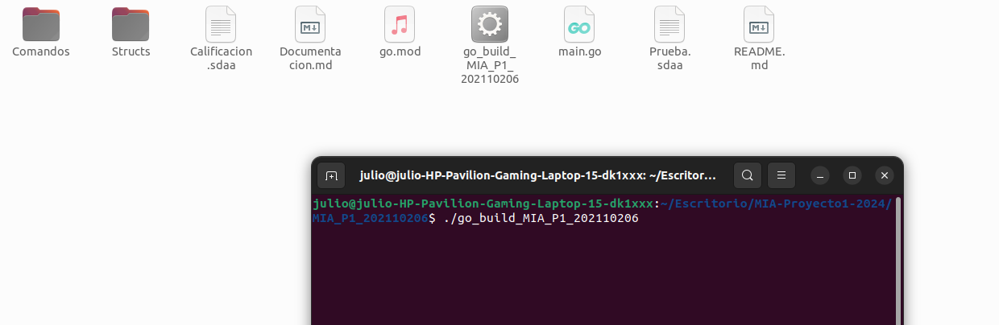

## Universidad de San Carlos de Guatemala
## Escuela de Ciencias y Sistemas, Facultad de Ingeniería
## Manejo e Implementacion de Archivos, 1er semestre 2024
-----
# PROYECTO1 - LAB ARCHIVOS - SECCION B
-----
### Nombre: Julio Alejandro Zaldaña Ríos
### Carnet: 202110206
-----

**Alcance Aplicación**

El alcance del proyecto comprende de una aplicacion de comandos elaborada en el lenguaje de programación Golang, en el sistema operativo Ubuntu 22.04 LTS.
EL objetivo primordial fue emular un sistema, que pueda crear discos (archivos binarios) y poder manejar estos mismos, creando particiones ya sea primarias, extendidas o lógicas,
al igual poder montarlas, para luego formatearlas con un tipo de sistema de archivo, ya sea EXT2 O EXT3. 
Se creará la opción de poder loguearse dentro de un sistema de archivos, y se podrán realizar diferentes operaciones y comandos, como crear carpetas, archivos etc.

De igual manera se podrán crear reportes para tener referencia de los datos que son creados y recuperados durante la ejecución de la aplicación de comandos.

**Puntos a tomar en cuenta**

Como puntos primordiales a tomar en cuenta, se debe de seguir.
Es que se pueden ingresar comandos manualmente uno por uno.
O bien se puede ejecutar un script o un archivo. 
Con el comando execute.

*Ejemplo*

*execute -path=/home/julio/Escritorio/MIA-Proyecto1-2024/MIA_P1_202110206/Prueba.sdaa*

**Tomar en cuenta que se estará trabajando y manejando los discos (archivos binarios) en la ruta base:**

*-path=/home/julio/Escritorio/MIA/P1*

**Y los reportes se manejarán en la ruta:**

*execute -path=/home/julio/Escritorio/MIA/Reportes*

**Para la ejecución con el ejecutable se puede utilizar en la terminal de Ubuntu**

